# 分层记忆治理数据流 (Hot / Warm / Cold Path)

Hippo 将记忆的捕获、沉淀与治理划分为清晰的三个层次（Tiered Memory Governance）：

```mermaid
flowchart TD
    subgraph HOT ["Hot Path (显式直写 · 毫秒级)"]
        H1["Agent / 用户显式调用<br/>(add_memory / hippo add)"] --> H2["infer=False 模式<br/>(跳过远程 LLM 提取)"]
        H2 --> H3["单次 Embedding 计算<br/>(直接向量化输入事实)"]
        H3 --> H4["获取写锁并写入 Qdrant & SQLite<br/>(耗时 < 200ms)"]
    end

    subgraph WARM ["Warm Path (会话蒸馏 · 分钟级)"]
        W1["宿主 Hook 触发<br/>(Session End / Turn Complete)"] --> W2["极速入队 Spool Storage<br/>(返回 < 50ms，零感知)"]
        W2 --> W3["后台 SpoolWorker 消费<br/>(infer=True，LLM 全文反思)"]
        W3 --> W4["注入 session_distillation 来源<br/>与 last_confirmed_at 时效元数据"]
    end

    subgraph COLD ["Cold Path (离线治理 · 定时/手动)"]
        C1["hippo consolidate 触发<br/>(支持 --since 增量扫描)"] --> C2["候选聚类发现<br/>(ANN 相似性近邻图)"]
        C2 --> C3["冲突 / 等价关系分类器<br/>(LLM 关系判别)"]
        C3 --> C4["幂等 Apply 执行<br/>(等价合并、版本废弃、状态收敛)"]
    end
```

---

## 1. Hot Path：Agent 显式直写

- **核心目标**：解决对话期间 Agent 沉淀记忆时的交互延迟，将耗时从 Mem0 默认的 8~13 秒骤降至 **<200ms**。
- **机制与实现**：
  - 强制使用 `infer=False`；
  - 仅对文本做单次嵌入并直接入库；
  - 自动附加 `source="agent_explicit"` 与 UTC ISO-8601 时效戳；
  - 确保 Agent 工具调用立即返回，不阻塞人类与 Agent 之间的交互。

---

## 2. Warm Path：会话记忆异步蒸馏

- **核心目标**：在用户不进行显式总结的情况下，从完整的长对话历史中提炼未被言明的偏好与踩坑教训。
- **机制与实现**：
  - 双事件触发：会话结束（Session End）与单轮响应完成（Turn Complete）；
  - 宿主通过 `hippo hook capture` 管道将原始会话转储至本地 Spool 队列（SQLite），耗时 <50ms 即退出；
  - 独立的 `SpoolWorker` 异步批量消费，使用配置的 LLM 执行多轮抽取并沉淀为记忆；
  - 记忆带有完整的 provenance（宿主来源、会话 ID、确认时间戳），便于后续追溯。

---

## 3. Cold Path：记忆整理与生命周期治理

- **核心目标**：长期运行后，记忆库中不可避免地会出现重复事实、互相冲突的偏好（例如“采用 Poetry”与后来的“迁移到 uv”），以及过期失效的技术计划。
- **机制与实现**：
  - **候选发现 (Candidate Discovery)**：使用 ANN 近邻检索和时间窗口筛选潜在相关的记忆对；
  - **关系分类 (Relationship Classification)**：通过高智商 LLM 判断两两记忆间的关系：
    - `EQUIVALENT`（等价事实）：合并为一条更精确的陈述，继承两者的引用；
    - `CONFLICT`（冲突事实）：以最新明确的决策为胜者，将旧记忆标记为 `SUPERSEDED`；
    - `DISTINCT`（独立事实）：保留两者。
  - **幂等 Apply**：基于行版本号（Record Version）与并发锁原子执行，支持 `--dry-run` 预览。
