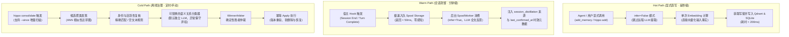

# 分层记忆治理数据流 (Hot / Warm / Cold Path)

Hippo 将记忆的捕获、沉淀与治理划分为清晰的三个层次（Tiered Memory Governance）：

```mermaid
flowchart TD
    subgraph HOT ["Hot Path (显式直写 · 毫秒级)"]
        H1["Agent / 用户显式调用<br/>(add_memory / hippo add)"] --> H2["infer=False 模式<br/>(跳过远程 LLM 提取)"]
        H2 --> H3["单次 Embedding 计算<br/>(直接向量化输入事实)"]
        H3 --> H4["获取写锁并写入 Qdrant & SQLite<br/>(耗时 < 200ms)"]
    end

    subgraph WARM ["Warm Path (会话蒸馏 · 分钟级)"]
        W1["宿主 Hook 触发<br/>(Session End / Turn Complete)"] --> W2["极速入队 Spool Storage<br/>(返回 < 50ms，零感知)"]
        W2 --> W3["后台 SpoolWorker 消费<br/>(infer=True，LLM 全文反思)"]
        W3 --> W4["注入 session_distillation 来源<br/>与 last_confirmed_at 时效元数据"]
    end

    subgraph COLD ["Cold Path (离线治理 · 定时/手动)"]
        C1["hippo consolidate 触发<br/>(支持 --since 增量扫描)"] --> C2["候选聚类发现<br/>(ANN 相似性近邻图)"]
        C2 --> C3["身份与活跃性复核<br/>精确匹配 / 空文本规则"]
        C3 --> C4["可替换的语义关系分类器<br/>(默认独立 LLM，异常保守弃权)"]
        C4 --> C5["WinnerArbiter<br/>确定性胜者仲裁"]
        C5 --> C6["幂等 Apply 执行<br/>(版本重验、软删除与恢复)"]
    end
```

---

## 1. Hot Path：Agent 显式直写

- **核心目标**：解决对话期间 Agent 沉淀记忆时的交互延迟，将耗时从 Mem0 默认的 8~13 秒骤降至 **<200ms**。
- **机制与实现**：
  - 强制使用 `infer=False`；
  - 仅对文本做单次嵌入并直接入库；
  - 自动附加 `source="agent_explicit"` 与 UTC ISO-8601 时效戳；
  - 确保 Agent 工具调用立即返回，不阻塞人类与 Agent 之间的交互。

---

## 2. Warm Path：会话记忆异步蒸馏与持久化门禁

- **核心目标**：在用户不进行显式总结的情况下，从完整的长对话历史中提炼未被言明的偏好与踩坑教训，同时建立严格的持久化质量门禁与防污染过滤（Issue #73）。
- **机制与实现**：
  - 双事件触发：会话结束（Session End）与单轮响应完成（Turn Complete）；
  - 宿主通过 `hippo hook capture` 管道将原始会话转储至本地 Spool 队列（基于 POSIX 目录状态机），耗时 <50ms 即退出；
  - **Durable Staging & Atomic Publish（原子发布与断电恢复，#80）**：摒弃有半成品风险的直接创建，先在 `staging/` 完整落盘并写入 `READY.json`，在跨进程 `publish.lock` 保护下原子重命名至 `jobs/` 并对父目录执行 `fsync`；Worker 启动前自动执行 `recover_spool_publication()` 自愈，杜绝 ghost 假死与同事件重放丢弃；
  - **Pre-check（蒸馏前预审）**：在调用 LLM 蒸馏前，`SpoolWorker` 审查会话是否为纯口头禅确认或纯运行时流水日志。无文件修改且无实质性目标的纯噪音会话被提前判定并跳过，节省 LLM Token；有任何实质性用户意图、修改文件或不确定的内容均保守 Fail-Open 放行；
  - **Prompt Hardening（防注入加固）**：基于 `SESSION_DISTILLATION_PROMPT_V2`，明确将会话转录作为不可信输入，严禁将 Transcript 中的 Prompt Injection / 指令覆盖持久化为规则；明确区分日志中的稳定架构配置（提取为干净事实）与运行时流水（忽略）；
  - **Post-audit（落库前质检）**：挂载在真实持久化调用入口（`HippoEngine._hook_memory_persistence` 拦截的 `vector_store.insert` 与 `update`）。只对 `source == "session_distillation"` 的后台写入生效，对提取后的记忆执行 `ACCEPT / DROP` 审查。被拒绝的项直接从批量写入中剔除或阻断更新，并记录到 `skipped_ids` 阻断 History 与 Entity 副作用，绝不篡改已生成向量的文本，且 Hot Path（`infer=False` / `add_explicit()`）零开销绕过；
  - **Concurrency Conflict & Retry（并发冲突与重试，#80）**：在持有写锁并持久化前对 Phase 1 检索到的前提记忆重验版本指纹。若观察上下文在提炼期间被并发修改、废弃或删除，`HippoEngine` 显式抛出类型化 `ContextConflictError`，`SpoolWorker` 将其识别为可重试冲突并通过指数退避重新放回 `pending`，绝不记录伪成功收据，待重试耗尽后方进入 `dead` 保留诊断现场；而合法的真正空提取或质量门禁空过滤仍作为终端成功处理；
  - 记忆带有完整的 provenance（宿主来源、会话 ID、确认时间戳），便于后续追溯。

---

## 3. Instance-Scoped Mem0 Adaptation & State Isolation：多实例绝对隔离 (#80)

- **核心目标**：彻底消除对 Mem0 全局类的侵入性 monkey-patch，保障多引擎实例并发或串行运行时的状态与生命周期安全。
- **机制与实现**：
  - **Dynamic Subclassing（实例级动态派生）**：通过派生子类 `HippoInstanceMemory` 仅拦截当前引擎实例的 `entity_store` 属性，全局 `mem0.Memory` 保持 100% 纯净；
  - **Ownership Guard（所属权守卫）**：在 `Mem0PersistenceAdapter` 中执行 `holder.engine is adapter.engine` 校验，非当前引擎持有的上下文锁对本实例完全透明；
  - **State Locality（状态局部化）**：各引擎实例具有独立的 vector store 拦截闭包、版本重验快照、skipped IDs 集合及实体关联映射；
  - **Coordinated Shared Locking（同身份互斥锁）**：同 namespace + 同 identity 的多实例依然遵循 ADR-0003 排他互斥；独立命名空间（如隔离测试）则并发完全无干扰。

---

## 4. Retrieval & Scope Isolation：强制身份边界与过滤器合取 (#80)

- **核心目标**：防范调用方传入自定义业务过滤条件时越权穿透或丢失用户/项目隔离边界，严格保证跨租户数据隔离（Forbidden Leakage = 0）。
- **机制与实现**：
  - **Mandatory Scope（强制身份范围）**：由 `ScopeRouter.resolve_search_scope()` 依据选定用户及 `project`/`global`/`all` 生成基准范围，不可被外部替换或绕过；
  - **Conjunction Composition（严格合取组合）**：通过 `compose_scope_filters()` 保留顶层 `user_id` 以满足 Mem0 的实体范围校验，并将剩余 mandatory scope 与调用方传入的任意 business filters（含分类、嵌套 `AND`/`OR`/`NOT`）作为受保护的嵌套合取表达式组合；调用方 filters 只能缩小结果集，不能覆盖或放宽身份边界，冲突身份约束返回 0 结果；
  - **Production & Trace Parity**：生产环境 `search()` 与评测诊断 `search_with_trace()` 共享同一套范围解析与过滤器组合路径，并统一在底层推下 `add_lifecycle_exclusion()` 废弃排除过滤。

---

## 5. Cold Path：记忆整理与生命周期治理

- **核心目标**：长期运行后，记忆库中不可避免地会出现重复事实、互相冲突的偏好（例如“采用 Poetry”与后来的“迁移到 uv”），以及过期失效的技术计划。
- **机制与实现**：
  - **候选发现 (Candidate Discovery)**：使用 ANN 近邻检索和时间窗口筛选潜在相关的记忆对；
  - **关系分类 (Relationship Classification)**：先复核 identity、活跃状态与精确文本规则，其余候选仅以只读 ID/事实文本投影交由分类器判定；默认仍使用独立 LLM。决策层对非独立关系再次应用低置信度门槛，分类器只返回关系、置信分值与可选审计证据：
    - `EQUIVALENT`（等价事实）：合并为一条更精确的陈述，继承两者的引用；
    - `CONFLICT`（冲突事实）：以最新明确的决策为胜者，将旧记忆标记为 `SUPERSEDED`；
    - `DISTINCT`（独立事实）：保留两者。
  - **胜者仲裁 (Winner Arbitration)**：分类为等价或冲突后，才按确认时间、来源权威和稳定性规则确定赢家；模型证据不能直接指定赢家。
  - **Jev 试验适配器（#61）**：`hippo_memory.jev.JevClient` 是显式构造、可注入 HTTP 客户端的独立适配器，固定 `jev-1.13.0` 与 `memory-relation-v1` 三分类问题。它验证完整概率分布、所选类别、独立的供应商 `confidence`、响应大小及模型版本；限时重试或任何协议错误都会留下不含原始事实的弃权代码。`JevRelationshipClassifier` 目前仅把原始判别写入审计证据，向治理层一律返回 `DISTINCT`，因此不会触发胜者仲裁或生成治理操作。默认路径不创建 Jev 客户端、不要求密钥、不出网；影子路由与自动启用分别留给后续议题。
  - **Jev 显式旁路（#63）**：仅在调用方显式注入 Jev 后端、设置项目 allowlist，且本次范围与记录身份均通过复核后，对同一文本快照旁路观察。匿名化差异报告在 `ConsolidationResult.shadow`，含降级/预算状态；结果不会进入主判、plan、journal 或 apply。默认 CLI 与治理路径仍不初始化 Jev。Jev 成对离线评测流水线见 [Jev 成对关系离线评测](/knowledge/jev-evaluation)，分类校准与双阈值门禁见 [Jev 分类校准与门禁](/knowledge/jev-calibration)。
  - **幂等 Apply**：基于行版本号（Record Version）与并发锁原子执行，支持 `--dry-run` 预览。
