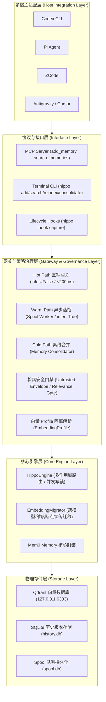

# 系统架构总览与设计哲学

## 🌟 核心原则 (Core Tenet)

> **Hippo 是 Mem0 的轻量工程封装：对齐官方规范，补齐开源短板。**
> - 原生支持的（数据结构、基础存储、基础检索），100% 保持对齐，不重复造轮子；
> - 开源版缺失或不完善的（如检索防污染门禁、瞬态短语清洗、多端自动路由、分层记忆治理），在 Hippo 网关层做必要补齐。

---

## 🏛️ 总体架构分层

Hippo 架构可自顶向下划分为五大层次：

---

## 📐 核心设计哲学

1. **前台直写不阻塞，后台异步求智能**：
   Agent 在会话过程中显式调用的记忆写入必须在 200ms 内完成，绝对不能因复杂的 LLM 反思抽取阻塞对话流；后台 Worker 负责从完整会话中提炼深层偏好。
2. **Context ≠ Policy（记忆是上下文，不是策略指令）**：
   所有从记忆库中召回的内容都被视为不可信历史输入（Untrusted Context）。必须使用统一的 `<hippo_retrieved_context>` 围栏隔离，绝不对 Agent 暴露底层微调参数，彻底阻断越权与指令逃逸。
3. **本地优先与最小依赖 (Local-First & Zero Bloat)**：
   全量采用 `uv` 与 `pnpm`，拒绝引入本地重型 Cross-Encoder 等冗余大模型依赖；底层基于单二进制 Qdrant 本地保活，零云端锁定。
4. **向量空间严格隔离与可逆迁移**：
   不同 Embedding 模型/维度绝不共享同一向量集合，切换 Provider 必须通过确定性的 Profile 集合隔离与断点续传迁移工作流保障数据安全。
