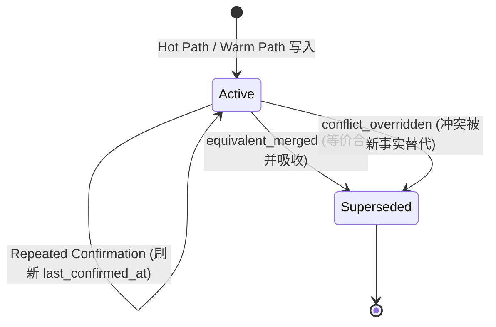

# Hippo Cold Path Memory Consolidation 架构设计 (Issue #17)

> 本文为**竣工版（as-built）**架构文档，随 #21–#25 五个实现 PR（#30 / #32 / #33 / #34 / #36）修订，
> 与代码行为一一对应。决策背景见 ADR-0003。

## 1. 架构定位与核心原则 (Architecture Context)

Hippo 在 Epic [#13](https://github.com/mungerism/hippo/issues/13) 中确立了 **“先捕获、后治理”（Capture First, Consolidate Later）** 的三层流水线架构：

```text
┌───────────────────────────────────────────────────────────────┐
│                      前台前置交互 (Foreground)                 │
├───────────────────────────────┬───────────────────────────────┤
│ Hot Path: add_explicit (#14)  │ MCP search_memories (#16)     │
│ - infer=False (无 LLM 延迟)   │ - Untrusted Context Envelope  │
│ - 注入 source='agent_explicit'│ - 结构转义，防提示注入        │
└───────────────────────────────┴───────────────────────────────┘
                                ▲
                                │ 异步回流
┌───────────────────────────────┴───────────────────────────────┐
│                      后台异步治理 (Background)                 │
├───────────────────────────────┬───────────────────────────────┤
│ Warm Path: Distillation (#15) │ Cold Path: Consolidation (#17)│
│ - Spool 队列异步消费           │ - MemoryConsolidator 编排     │
│ - infer=True 会话事实提炼     │ - 语义等价合并 (Merge)        │
│ - 注入 session_distillation   │ - 冲突事实消解 (Supersede)    │
│ - 继承捕获时效 last_confirmed  │ - 软删除标记，纯净检索通道    │
└───────────────────────────────┴───────────────────────────────┘
```

**核心设计原则**：
1. **解耦前台**：Consolidation 属于纯离线/异步 Cold Path，绝不在前台 `add_memory` 或 `search_memories` 链路中同步执行；
2. **血统完整与可审计 (Provenance & Auditability)**：不无痕物理删除数据；通过软删除（`status="superseded"`）与元数据合并链（`merged_ids`、`superseded_by`）保留历史证据；
3. **确定性两阶段决策 (Deterministic Two-Phase Decision)**：关系判定（EQUIVALENT / CONFLICT / DISTINCT）只看文本；winner 仲裁只看时效 / 权威 / 确认证据 / 稳定性——两者严格分离；
4. **自愈与幂等 (Idempotency & Resilience)**：确定性 operation_id + 原子 journal + recovery pass，进程崩溃或重试不破坏现有事实，重复运行最终 mutation 为零；
5. **失败即收紧 (Fail Closed)**：分类器异常 / 低置信度 / 输出畸形 / identity 无法证明 / 版本过期——一律降级为 DISTINCT 或 stale，绝不基于不确定状态执行 destructive mutation。

---

## 2. 模块布局与领域模型 (Modules & Domain Model)

### 2.1 模块布局（与实现一一对应）

| 模块 | 职责 | Issue |
|---|---|---|
| `hippo_memory/candidate_discovery.py` | 纯读 ANN 邻域发现：identity 硬边界、`since` 只筛增量 seed、superseded/expiration 下推 + 防御校验、扫描上限 fail-closed | #21 |
| `hippo_memory/decision.py` | 关系分类（确定性 exact-match 优先，其余走独立 LLM seam，fail-closed）+ winner 仲裁（recency → authority → confirmation → stability） | #22 |
| `hippo_memory/apply.py` | 唯一 mutation 层：OperationPlan / OperationJournal / ConsolidationApplier（共享写锁 + 版本指纹重验 + crash 恢复） | #23 |
| `hippo_memory/lifecycle.py` | 统一 lifecycle invariant：superseded 不进入任何 Agent recall，独立于 relevance gate | #24 |
| `hippo_memory/consolidator.py` | `MemoryConsolidator.consolidate()` 编排 + `ConsolidationResult` 聚合 | #25 |
| `hippo_memory/cli.py` | `hippo consolidate` 离线治理入口（--dry-run 预览 / DESTRUCTIVE 执行显式区分） | #25 |

### 2.2 记忆生命周期状态机

只有两种生命周期状态；“合并”与“冲突淘汰”都是 supersede，以 `supersede_reason` 区分：



### 2.3 元数据契约 (Extended Metadata Schema)

在 #14 / #15 已有字段基础上扩展 Consolidation 治理字段：

```json
{
  "source": "agent_explicit | session_distillation",
  "category": "preference | decision | pitfall | general",
  "created_at": "2026-09-10T04:30:00+00:00",
  "updated_at": "2026-09-10T05:00:00+00:00",
  "last_confirmed_at": "2026-09-10T04:30:00+00:00",

  "status": "active | superseded",
  "superseded_by": "uuid-winner-id",
  "superseded_at": "2026-09-10T05:00:00+00:00",
  "supersede_reason": "equivalent_merged | conflict_overridden",
  "confirmation_count": 2,
  "merged_ids": ["uuid-absorbed-1"],
  "merged_contributions": {"uuid-winner-id": 1, "uuid-absorbed-1": 1},
  "merged_sources": ["agent_explicit", "session_distillation"]
}
```

### 2.4 归约结果实体 (`ConsolidationResult`)

```python
@dataclass
class ConsolidationResult:
    scope: str
    project_id: str | None
    scanned: int
    seeds: int
    candidate_pairs: int
    classified_equivalent: int
    classified_conflict: int
    classified_distinct: int
    merged: int
    superseded: int
    unchanged: int          # 仅计幂等重放 (already_applied)
    stale_plans: int
    errors: list[str]       # 每条带阶段前缀: [discovery]/[decision]/[planning]/
                            # [apply]/[recovery]/[classifier]
    details: list[dict]     # operation_id / relation / winner_id / loser_id /
                            # reason / result,逐决策可审计

    def stats(self) -> dict[str, int]   # 计数器视图
    def to_dict(self) -> dict[str, Any]
    @property
    def is_success(self) -> bool
```

**计数器语义**：`merged` / `superseded` / `unchanged` / `stale_plans` 统计**本次运行完成的治理 operation**，而非原始 store mutation——幂等重放（含输掉竞态的 recovery）计 `unchanged`；crash-window recovery 补完一个 mutation 已落盘的 operation 仍计 `merged`/`superseded`；DISTINCT 只通过 `classified_distinct` 体现。

---

## 3. 核心流水线 (Consolidation Pipeline)

```mermaid
flowchart TD
    A[MemoryConsolidator.consolidate] --> B[resolve_scope_identity 解析 identity]
    B --> R[recovery pass: 筛选该 identity 的 unfinished journal 并补完]
    R --> C[CandidateDiscovery: 增量 seed + ANN 邻域, 纯读, 不持锁]
    C --> D{存在 candidate edge?}
    D -- 否 --> E[直接结束: operation counters 保持 0]
    D -- 是 --> F[逐 edge: 重查 lifecycle + 双记录读取]
    F --> G[两阶段决策: 关系分类 → winner 仲裁]
    G --> H[固化 Operation Plan: 确定性 operation_id]
    H --> I{dry_run?}
    I -- 是 --> J[仅记录 decision 预览, 零 mutation]
    I -- 否 --> K[Idempotent Apply: apply() 逐 operation 获取共享写锁, journal + 版本重验 + 原子落盘]
    K --> L[按 operation outcome 聚合统计]
    J --> L
    L --> M[ConsolidationResult]
```

> 锁粒度说明：共享写锁不是 run 级长锁——discovery 与分类阶段全程不持锁，由
> `ConsolidationApplier.apply()` 围绕每次 re-read、指纹校验与 mutation 获取，
> Hot/Warm 写入方因此在两次治理操作之间不受阻塞。

### 3.1 候选发现 (#21, `CandidateDiscovery`)
- 以 `(user_id, agent_id)` 为硬 identity 边界，不跨 identity 治理；
- `since` 只限制增量 seed，历史 active 记忆仍可作为 ANN neighbor；
- superseded / expiration 过滤**下推 store 查询**，返回后对两类条件均做防御性校验（identity、superseded、expiration 逐一复核）；
- ANN top-K 直连 vector store（绕过 Mem0 hybrid 重排），阈值可配置（默认 0.85）；
- 只输出**直接 candidate edge**，不推导传递关系（连通分量不作为等价证据）；
- 扫描上限溢出显式失败（`CandidateScanLimitExceeded`），不静默盲扫。

### 3.2 两阶段决策 (#22, `RelationshipClassifier` + `WinnerArbiter`)

**阶段一：关系分类**（只看文本，时间/来源/确认数不参与）：
- 归一化完全匹配 → EQUIVALENT（置信度 1.0）；
- 其余进入 LLM seam：分类器**无工具权限**，记忆文本经转义包裹为 untrusted 数据；请求 `response_format=json_object`，整个响应必须是恰好一个 JSON 对象；
- malformed / 异常 / 置信度低于阈值 → 一律 fail-closed 为 DISTINCT（DISTINCT 永远不产生 mutation plan）；
- 分类器 LLM 为**独立实例**（deep-copy provider 配置，`temperature=0`），不触碰 Hot/Warm 共享的 `engine.memory.llm`。

**阶段二：winner 仲裁**（仅对 EQUIVALENT / CONFLICT，规则顺序固定）：
1. **Recency**：`last_confirmed_at` 严格新于 `recency_margin_seconds`（默认 60s，可配置）者胜；freshness 缺失（单边或双边）则跳过——`updated_at` 不是确认信号；
2. **Authority**：`agent_explicit` > `session_distillation`；
3. **Confirmation**：`confirmation_count` 高者胜（默认 1）；
4. **Stability**：更早 `created_at` 优先，最终以 memory ID 字典序保证全序。

### 3.3 幂等应用 (#23, `build_operation_plan` + `ConsolidationApplier`)

- **Operation Plan**：`operation_id` 由 (identity, relation, winner, loser, 双侧 observed 版本指纹) 确定性哈希生成——相同规划必然命中同一 journal 条目；
- **Operation Journal**：`~/.hippo/consolidation/operations/<operation_id>.json`，原子持久化顺序为「写临时文件并 fsync → rename → 对父目录 fsync」（目录 fsync 必须在 rename 之后，否则断电可能丢失目录项），状态机 `planned -> applying -> completed`（`failed` 可重试；`stale` 终态，由重规划产生新 ID）；`unfinished()` 供 crash 恢复扫描；
- **Apply 顺序**：持锁 → journal 落盘（planned，winner patch 先于任何 mutation 持久化）→ crash-window 检测 → **双侧 observed/post-apply 版本重验 → 才允许 mutation** → 逐步骤翻转 journal → completed；
- **stale 语义**：任一侧被 Hot/Warm 写过 → 拒绝执行**后续** mutation 并标记 `stale_plan`。注意 stale ≠ 完全无副作用：崩溃前已落盘的部分变更（如 winner 合并）不会回滚，但其终态由 post-apply 指纹记录、可审计；重规划经 lineage 去重必然收敛；
- **等价合并**（全部为绝对值聚合，禁止 `+=`）：`merged_ids = set-union(winner lineage, loser, loser lineage)`；`confirmation_count` 与 `merged_contributions`（不可变 member→own 贡献快照）按 spec 公式「unique lineage 确认数之和（default 1）」计算：两侧快照做 **union-max 去重合并**（同一成员出现在两侧——如 crash-window 后 loser 被 Hot/Warm 重新激活并再吸收——只计一次），无快照的简单记录贡献自身 `count`（每平铺被吸收成员减 1,对既有 union-sum 写入精确）。可变血统/计数的任何后见状态都无法干扰贡献值，crash-window 重规划与并发竞态既不重复计数也不丢失成员；`last_confirmed_at = max(lineage)`；**winner 文本永不改写**；
- **冲突消解**：winner 不继承 loser 确认数；loser 软删除并指向 winner。

### 3.4 检索防污染 (#24, `hippo_memory/lifecycle.py`)

superseded 过滤是**独立于 relevance gate 的 lifecycle invariant**，所有 Agent-facing recall seam（`search` / `get_memories` / `list_memories` / `get_user_profile` / MCP `search_memories`）双保险：store 查询下推 + 返回后防御校验，均发生在 gate 之前——gate 禁用时依然生效。流水线顺序：

```text
Mem0 raw results → Lifecycle Filter (active-only) → Relevance Gate
→ Untrusted Context Renderer → Agent
```

audit 语义与 recall 分离：`get(memory_id)` 与 history 可读取 superseded 记录及完整 provenance。

### 3.5 Crash 恢复 (#25, recovery pass)

`consolidate()` 在 discovery 之前扫描本 identity 的 unfinished journal 并重建 OperationPlan 补完。三个单步崩溃窗口的收敛保证：

| 崩溃点 | 恢复行为 |
|---|---|
| winner 已更新 / loser 未 supersede | journal 重放跳过已完成步骤，仅补 loser；计数不重复 |
| loser 已 supersede / journal 未 completed | recovery pass 零 mutation 补完 journal（该 pair 已不可被 rediscover） |
| winner 写盘后、journal 翻转前崩溃 | 无已持久化的 post-apply 指纹 → 不匹配 observed → fail-closed stale → 重规划经 lineage 去重收敛（`test_crash_window_without_journal_flip_fails_closed_then_converges` 固定该行为） |
| journal `applying` / 进程崩溃（一般） | **不是一律 stale**，逐侧比对指纹：已完成步骤匹配 post-apply（或 loser 已处于目标状态）→ 原地续跑或只补完 journal；未执行步骤按 observed 校验后续跑；任一侧与 observed 和 post-apply 均不匹配（外部写入）→ stale |

---

## 4. CLI 与运行契约 (#25)

```bash
hippo consolidate --scope project
hippo consolidate --scope project --project hippo
hippo consolidate --scope project --since 24h        # <n>h / <n>d / <n>w 或 ISO-8601
hippo consolidate --scope project --dry-run
```

- `--dry-run`：只输出 decisions/plans 预览，零 mutation、零 destructive journal 状态变化（含 recovery pass——pending operation 仅以 `recovery:dry_run` 预览）；
- 输出显式区分 **DRY-RUN 预览** 与 **DESTRUCTIVE 执行**，并给出完整统计表与逐决策明细；
- 默认不绑定每次 write，V1 不启用自动 scheduler——`consolidate()` 是未来 scheduler 的稳定调用入口。

## 5. 实现记录 (Landed)

| Issue | 内容 | PR |
|---|---|---|
| #21 | Candidate Discovery 与 Identity Boundary | #30 |
| #22 | Relationship Classification 与 Winner Arbitration | #32 |
| #23 | Idempotent Apply、Operation Journal 与并发安全 | #33 |
| #24 | 统一 Memory Lifecycle Filter | #34 |
| #25 | MemoryConsolidator 编排、CLI 与 E2E | #36 |

测试：`tests/test_candidate_discovery.py`、`tests/test_consolidation_decision.py`、`tests/test_consolidation_apply.py`、`tests/test_lifecycle_filter.py`、`tests/test_consolidator.py`（全量 239/239，含双轴 Standards/Spec review 流程）。
