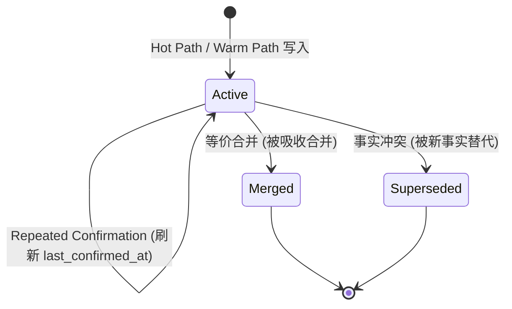
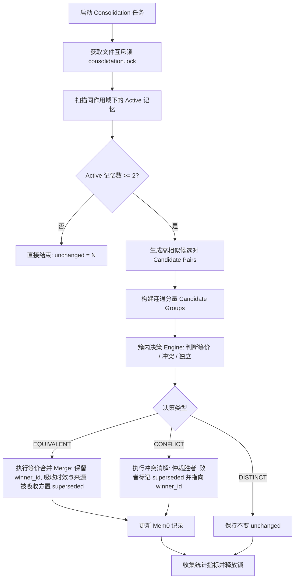

# Hippo Cold Path Memory Consolidation 架构设计 (Issue #17)

## 1. 架构定位与核心原则 (Architecture Context)

Hippo 在 Epic [#13](https://github.com/mungerism/hippo/issues/13) 中确立了 **“先捕获、后治理”（Capture First, Consolidate Later）** 的三层流水线架构：

```text
┌───────────────────────────────────────────────────────────────┐
│                      前台前置交互 (Foreground)                 │
├───────────────────────────────┬───────────────────────────────┤
│ Hot Path: add_explicit (#14)  │ MCP search_memories (#16)     │
│ - infer=False (无 LLM 延迟)   │ - Untrusted Context Envelope  │
│ - 注入 source='agent_explicit'│ - 结构转义，防提示注入        │
└───────────────────────────────┴───────────────────────────────┘
                                ▲
                                │ 异步回流
┌───────────────────────────────┴───────────────────────────────┐
│                      后台异步挖掘 (Background)                 │
├───────────────────────────────┬───────────────────────────────┤
│ Warm Path: Distillation (#15) │ Cold Path: Consolidation (#17)│
│ - Spool 队列异步消费           │ - 离线归约调度 (CLI / Job)    │
│ - infer=True 会话事实提炼     │ - 语义等价合并 (Merge)        │
│ - 注入 session_distillation   │ - 冲突事实消解 (Supersede)    │
│ - 继承捕获时效 last_confirmed  │ - 软删除标记，纯净检索通道    │
└───────────────────────────────┴───────────────────────────────┘
```

**核心设计原则**：
1. **解耦前台**：Consolidation 属于纯离线/异步 Cold Path，绝不在前台 `add_memory` 或 `search_memories` 链路中同步执行；
2. **血统完整与可审计 (Provenance & Auditability)**：不无痕物理删除数据；通过软删除（`status="superseded"`）与元数据合并链（`merged_ids`、`superseded_by`）保留历史证据；
3. **确定性胜者仲裁 (Deterministic Winner Arbitrage)**：基于 `last_confirmed_at`（时效）与 `source`（权威度：`agent_explicit` > `session_distillation`）仲裁冲突胜者；
4. **自愈与幂等 (Idempotency & Resilience)**：多次执行结果收敛稳定，进程崩溃或重试不破坏现有事实与索引。

---

## 2. 领域模型与契约 (Domain Model)

### 2.1 记忆生命周期状态机



### 2.2 元数据契约扩展 (Extended Metadata Schema)

在 #14 / #15 已有字段基础上扩展 Consolidation 治理字段：

```json
{
  "source": "agent_explicit | session_distillation",
  "category": "preference | decision | pitfall | general",
  "created_at": "2026-09-10T04:30:00+00:00",
  "updated_at": "2026-09-10T05:00:00+00:00",
  "last_confirmed_at": "2026-09-10T04:30:00+00:00",
  
  // Cold Path 治理字段 (可选)
  "status": "active | superseded",
  "superseded_by": "uuid-winner-id",
  "superseded_at": "2026-09-10T05:00:00+00:00",
  "supersede_reason": "冲突消解：事实已被更新的确认项替代",
  "confirmation_count": 2,
  "merged_ids": ["uuid-merged-old-1"],
  "merged_sources": ["agent_explicit", "session_distillation"]
}
```

### 2.3 归约结果实体 (`ConsolidationResult`)

```python
from dataclasses import dataclass, field
from typing import List, Dict, Any

@dataclass
class ConsolidationResult:
    scope: str
    project_id: str | None
    scanned: int = 0
    merged: int = 0
    superseded: int = 0
    unchanged: int = 0
    errors: List[str] = field(default_factory=list)
    details: List[Dict[str, Any]] = field(default_factory=list)

    @property
    def is_success(self) -> bool:
        return len(self.errors) == 0
```

---

## 3. 核心流水线算法 (Consolidation Pipeline)



### 3.1 候选集挖掘 (Candidate Generation)
- 过滤：仅拉取 `status != "superseded"` 的 active 记忆；
- 两两比对或向量邻近搜索：
  - 针对小规模候选（如单个项目典型 10~100 条记忆），通过嵌入向量余弦相似度或搜索邻居计算相似对；
  - 设定相似度高门槛：`threshold >= 0.85`（低于此门槛判定为完全无关事实）；
- 聚类：通过简单并查集或连通分量，将重叠相似对聚合成群组（Groups）。

### 3.2 判定仲裁规则 (Arbitration Rules)
对于包含冲突或重复事实的候选群组：
1. **胜者决策优先级**：
   - **时间优先 (Recency Rule)**：`last_confirmed_at` 明显较新（时间差 > 60s）者为胜者；
   - **权威优先 (Authority Rule)**：若 `last_confirmed_at` 时间相同或接近（<= 60s），显式写入 `agent_explicit` 优于会话提炼 `session_distillation`；
   - **创建优先 (Stability Rule)**：若权威与时间完全一致，以先创建的 `created_at` 优先。
2. **等价合并 (Merge)**：
   - 提取更完整规范的事实表达作为 `text`；
   - 更新胜者 metadata：`last_confirmed_at = max(all)`，`confirmation_count += len(merged)`，记录 `merged_ids`；
   - 被合并者标记：`status = "superseded"`, `superseded_by = winner.id`, `supersede_reason = "equivalent_merge"`.
3. **冲突消解 (Conflict)**：
   - 胜者保持 active，败者标记 `status = "superseded"`, `superseded_by = winner.id`, `supersede_reason = "conflict_overridden"`.

### 3.3 前台检索联动过滤 (Retrieval Protection)
在 [`hippo_memory/gate.py`](file:///Users/munger/Code/Repos/personal/hippo/hippo_memory/gate.py) 或检索结果映射时，主动过滤掉 `status == "superseded"` 的事实，确保 Agent 在通过 `search_memories` 检索时不会获得已过时或被废弃的历史污染。

---

## 4. 实施阶段与任务分解 (Task Breakdown)

- [ ] **Phase 1: 核心模型与接口定义**
  - 定义 `ConsolidationResult`、决策枚举与 TypedDict 数据结构；
  - 在 [`hippo_memory/consolidator.py`](file:///Users/munger/Code/Repos/personal/hippo/hippo_memory/consolidator.py) 中实现 `MemoryConsolidator` 框架；
- [ ] **Phase 2: 邻域发现与仲裁逻辑实现**
  - 实现基于向量相似度与连通分量的候选挖掘；
  - 实现等价判定与冲突仲裁算法（包含规则策略与 LLM fallback 支持）；
  - 实现并发文件锁与原子状态更新；
- [ ] **Phase 3: 检索过滤联动**
  - 在 gate / router 中增加对 `superseded` 状态的防污染拦截；
- [ ] **Phase 4: CLI 与调度接入**
  - 新增 `hippo consolidate --scope=project` 命令；
- [ ] **Phase 5: 严密单测与双轴 Code Review**
  - 编写 `tests/test_consolidation.py` 验证等价合并、冲突淘汰、幂等性与历史回溯；
  - 执行本地 Standards 与 Spec Review。
