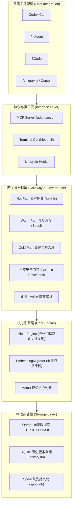

## 🏛️ 核心架构与数据流 {#core-architecture}

```mermaid
flowchart TD
    subgraph HOSTS ["多宿主适配层 (Host Integration)"]
        H1["Codex CLI"]
        H2["Pi Agent"]
        H3["ZCode"]
        H4["Antigravity / Cursor"]
    end

    subgraph INTERFACE ["协议与接口层 (Interface Layer)"]
        I1["MCP Server (add / search)"]
        I2["Terminal CLI (hippo-cli)"]
        I3["Lifecycle Hooks"]
    end

    subgraph GATEWAY ["网关与治理层 (Gateway & Governance)"]
        G1["Hot Path 直写网关 (亚秒级)"]
        G2["Warm Path 异步蒸馏 (Spool)"]
        G3["Cold Path 离线合并治理"]
        G4["检索安全门禁 (Context Envelopes)"]
        G5["向量 Profile 隔离解析"]
    end

    subgraph CORE ["核心引擎层 (Core Engine)"]
        C1["HippoEngine (多作用域路由 / 并发锁)"]
        C2["EmbeddingMigrator (向量断点迁移)"]
        C3["Mem0 记忆核心封装"]
    end

    subgraph STORAGE ["物理存储层 (Storage Layer)"]
        S1["Qdrant 向量数据库 (127.0.0.1:6333)"]
        S2["SQLite 历史版本存储 (history.db)"]
        S3["Spool 队列持久化 (spool.db)"]
    end

    HOSTS --> INTERFACE
    INTERFACE --> GATEWAY
    GATEWAY --> CORE
    CORE --> STORAGE
```

  

    Hippo 遵循 100% 本地优先原则，基于本地单二进制 Qdrant (127.0.0.1:6333) 与 uv / pnpm 极简依赖运行。
  

