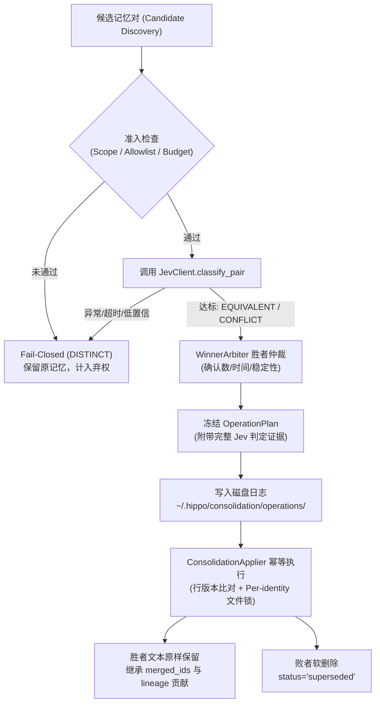

# Jev 关系分类受控接管操作与排障指南

在 Hippo 的离线治理（Cold Path）体系中，`EQUIVALENT`（合并）与 `CONFLICT`（作废/替代）属于破坏性治理操作。Issue #65 落地了受控的 Jev 关系分类接管架构：在且仅在白名单项目、匹配的合格校准产物以及可审计的运行预算同时具备时，允许 Jev 关系分类进入既有仲裁、计划与幂等执行流程；任何条件缺失或异常均保留原记忆。

---

## 🌟 核心准入门禁与安全契约

Jev 接管执行模式（`JevTakeoverClassifier`）对运行环境执行严格的准入校验，任何一项未通过均会拒绝初始化或 Fail-Closed 弃权：

1. **项目级白名单 (`allowed_projects`)**：
   - 必须显式声明允许接管的项目列表（如 `frozenset({"hippo", "my-project"})`）；
   - 绝不允许空白名单；对于 `scope="global"` 或未在白名单中的项目，分类器强制判定为 `not_allowed` 并弃权为 `DISTINCT`，绝不向 Jev 发送任何请求。
2. **固定模型与 Rubric 契约**：
   - 模型名称强制固定为 `jev-1.13.0`；
   - Rubric 协议版本固定为 `memory-relation-v1`；
   - Rubric 内容的 SHA-256 哈希值必须与当前运行时代码计算出的值完全一致，防篡改防漂移。
3. **合格校准产物准入**：
   - 校准产物状态必须为 `status == "GO"`；
   - `qualification.is_qualified_for_takeover` 必须为 `True`；
   - 产物内部的 `active_configuration` 必须与运行时参数完全对齐。
4. **硬性运行预算截断**：
   - 单次治理运行支持设置最大调用次数（`max_calls`，默认 200）与运行时间截止期（`max_elapsed_seconds`，默认 60s）；
   - 达到任一预算阈值后，后续候选对全部安全弃权为 `DISTINCT`，并标记运行状态为 `degraded`。
5. **Fail-Closed 弃权与绝不静默回退**：
   - 当概率低于校准阈值、Margin 低于门槛、Top-1 概率并列（Tie）、服务异常或网络超时时，一律判定为 `DISTINCT` 并输出显式证据；
   - **严禁静默回退**：接管模式下绝不隐式调用远程大模型兜底，确保运行成本与行为完全可控。

---

## 🏗️ 决策分工与数据边界



- **Jev 职能**：仅输出三分类关系，不能决定赢家、改写事实或跳过版本重验。
- **治理保护**：胜者文本不改写，败者软删除；下游检索保证 `Forbidden Leakage = 0`。

---

## 🚀 部署与使用示例

在构建 `MemoryConsolidator` 时注入 `JevClient` 与经过校准的 `JevTakeoverPolicy`：

```python
from hippo_memory.engine import HippoEngine
from hippo_memory.consolidator import MemoryConsolidator
from hippo_memory.jev import JevClient
from hippo_memory.jev_calibration import load_calibration
from hippo_memory.jev_takeover import JevTakeoverPolicy

# 1. 加载通过 RFC 验收门禁的校准产物
calibration_artifact = load_calibration("benchmarks/reports/calibration_jev_v1.json")

# 2. 构造显式策略
policy = JevTakeoverPolicy(
    allowed_projects=frozenset({"hippo-dev"}),
    calibration_artifact=calibration_artifact,
    max_calls=100,
    max_elapsed_seconds=30.0,
)

# 3. 初始化客户端与整合器
client = JevClient(api_key="your-typesafe-api-key")
consolidator = MemoryConsolidator(
    engine=engine,
    takeover_backend=client,
    takeover_policy=policy,
)

# 4. 执行白名单项目记忆治理
result = consolidator.consolidate(scope="project", project_id="hippo-dev")
print("治理结果:", result.stats())
print("Jev 接管报告:", result.takeover)
```

---

## 🛠️ 排障与诊断指南

### 1. 常见状态分析

- `result.takeover["status"] == "ok"`：全量正常完成，无服务异常且未超预算；
- `result.takeover["status"] == "not_allowed"`：当前执行的项目不在 `allowed_projects` 白名单内，或运行为 `scope="global"`；所有成对事实均被安全保留；
- `result.takeover["status"] == "degraded"`：发生过服务错误（如 `http_503`、网络超时）或触碰了调用/时间预算上限，所有受影响样本已自动弃权为 `DISTINCT`。

### 2. 审计证据检索

所有接管决策在 Apply 前均已完整持久化至磁盘日志：
```bash
cat ~/.hippo/consolidation/operations/<operation_id>.json | jq .evidence
```

输出示例：
```json
{
  "classification": {
    "reason": "jev_takeover_calibrated",
    "confidence": 0.92,
    "details": {
      "provider": "jev",
      "model": "jev-1.13.0",
      "choice": "EQUIVALENT",
      "selected_probability": 0.92,
      "margin": 0.84,
      "calibration_artifact_id": "calib-jev-1.13.0-prod",
      "status": "takeover_accepted"
    }
  },
  "arbitration": {
    "winner_id": "mem_winner",
    "loser_id": "mem_loser",
    "reason": "confirmation_count"
  }
}
```

---

## 🚒 灾备与演练手册 (Runbook)

### 场景一：崩溃恢复（Crash Recovery）
当治理进程在执行写操作期间意外中断（如断电、kill 等），重新运行治理时：
1. `_recover_unfinished` 会在候选发现前优先扫描未完成的 Journal 条目；
2. 直接重放已冻结的 `OperationPlan`；
3. **零网络调用**：不重新调用 Jev，避免因网络抖动导致已确定的判定发生变化；
4. 若底层数据已被其他前台操作修改，版本重验机制会标记为 `stale_plan` 并安全跳过。

### 场景二：误合并定向回滚（Targeted Reversal）
若经人工核实发现某次合并属于误判，可通过 `ConsolidationApplier.revert` 实施单操作原子回滚：

```python
# 针对特定的 operation_id 执行回滚
revert_summary = consolidator.applier.revert("op_20261003_123456_abcdef")
print(f"操作已回滚: 败者 {revert_summary['loser_id']} 已重新激活为 active")
```

- **回滚保障**：
  - 败者记忆元数据中的 `status` 恢复为 `active`，清除 `superseded_by` 等标记；
  - 胜者记忆的 `merged_ids` 中剔除该败者，并重新计算修正确认计票；
  - 日志条目标记为 `status: "reverted"`；
  - 下游 `engine.search()` 即刻重新能够召回被恢复的败者记忆。

### 场景三：平滑停用 Jev 接管
若需紧急停用 Jev：
1. 从 `MemoryConsolidator` 中移除 `takeover_backend` 与 `takeover_policy` 参数；
2. 系统自动平滑恢复为默认的本地/远程 LLM 分类模式；
3. **历史无损**：停用操作绝不会撤销或损坏先前已经成功落地的历史合并与替代操作；
4. 针对停用前尚未完成的断点操作，新的 Consolidator 实例依然能通过冻结计划直接完成幂等恢复。
