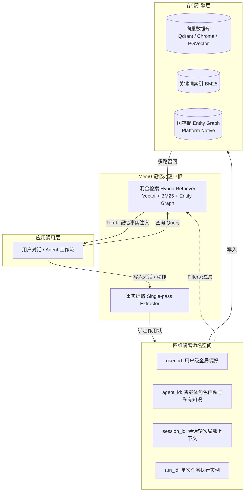

# Mem0 深度调研报告：面向大模型与智能体的长短期记忆层

> **调研日期**：2026年9月  
> **核心仓库**：[mem0ai/mem0](https://github.com/mem0ai/mem0) | **官方文档**：[docs.mem0.ai](https://docs.mem0.ai/)  
> **核心论文**：[*Mem0: Building Production-Ready AI Agents with Scalable Long-Term Memory* (arXiv:2504.19413)](https://arxiv.org/abs/2504.19413)

---

## 1. 项目背景与定位 (Overview & Background)

### 1.1 什么是 Mem0
**Mem0**（发音为 *Mem-zero*，前身为知名的开源 RAG 开发框架 **Embedchain**）是一个专为大语言模型（LLM）和自主智能体（AI Agents）打造的**自进化、持久化长短期记忆层（Memory Layer for Personalized AI）**。

在传统 LLM 应用与智能体架构中，模型本身是无状态（Stateless）的：
- **Context Window 瓶颈**：随着对话轮次增加，原始对话历史线性膨胀，消耗大量 Token 并引发模型注意力稀释（Attention Loss）与 "Lost in the Middle" 现象。
- **跨会话记忆缺失**：用户在不同 Session 或与不同 Agent 交互时，之前的偏好、事实与历史行为完全断联。
- **传统 RAG 的局限**：普通文档级切块与语义检索（Chunking + Vector Search）无法有效建模“人的偏好演进”、“实体间动态关系”以及“事实修正/撤销”。

Mem0 作为一个“智能记忆中间件”，在应用层与底层存储/LLM 之间建立了标准化的记忆抽取、索引、更新与融合检索机制，使 Agent 能够像人脑一样持续积累并修正事实，提供真正个性化的交互体验。

### 1.2 团队与发展历程
- **创始人团队**：由 **Taranjeet Singh**（CEO）与 **Deshraj Yadav**（CTO，前特斯拉 Autopilot AI 平台负责人）联合创立。
- **前身积累**：团队此前开发了开源 RAG 框架 Embedchain，在 GitHub 上累计收获大量 Star 并积累了超过 200 万次下载。在洞察到“仅做文档检索不足以支撑自主 Agent，个性化记忆才是智能体真正壁垒”后，全面升级转型为 Mem0。
- **资本与孵化**：入选 **Y Combinator (YC S24)**，并在 2025 年底完成了由 Basis Set Ventures 领投，Peak XV Partners、Kindred Ventures、GitHub Fund 及 YC 跟投的 **2400 万美元** 融资。
- **社区热度**：GitHub 开源仓库 Star 数超过 25k+，已成为当前开源 Agent 记忆框架领域最具影响力的项目之一。

---

## 2. 核心架构与多维作用域 (Architecture & Scoping Model)

Mem0 的核心设计哲学是将记忆从“被动的文本块存储”转变为“具备结构化身份隔离的事实元数据单元”。



### 2.1 四大多维作用域 (Identity Dimensions)
Mem0 原生设计了灵活的多租户/多角色作用域体系，允许在写入和召回时自由组合：
1. **`user_id`（用户级）**：
   - 全局跨会话持久记忆。记录用户的恒常偏好（如饮食习惯、代码风格、居住城市、家庭成员关系）。
2. **`agent_id`（智能体级）**：
   - 智能体特定的知识与行为习惯。在 Multi-Agent 架构中，区分不同职责 Agent 的内部记忆（如 Support-Bot 与 Sales-Bot）。
3. **`session_id`（会话级）**：
   - 绑定特定对话通道或短期交互任务，生命周期跟随单次会话。
4. **`run_id`（工作流运行级）**：
   - 针对自动化流水线（如特定批次的数据处理任务）的瞬时记忆。

---

## 3. 记忆管道演进机制 (Pipeline Evolution: v1/v2 vs v3)

Mem0 经历了重大的架构迭代，尤其是从早期的 v1/v2 管道跃迁至最新的 **v3 记忆架构**。理解两者的区别对技术选型至关重要：

### 3.1 经典 v1/v2 管道：双阶段决策（Two-Pass & In-place Mutation）
在早期版本中，Mem0 的核心是状态机的原地增删改：
1. **Fact Extraction**：调用 LLM 从用户输入中抽取出若干原子事实（Atomic Facts）。
2. **Vector Retrieval**：使用抽取的事实到向量库检索语义最接近的 Top-K 历史记忆。
3. **LLM 仲裁决策（ADD / UPDATE / DELETE / NOOP）**：
   - `ADD`：全新事实，分配新 Memory ID 并插入向量库。
   - `UPDATE`：新事实与旧事实部分矛盾或补充（例如“我换成了 Rust”），LLM 原地覆盖更新旧记录内容。
   - `DELETE`：新信息明确否定旧记忆，删除对应记录。
   - `NOOP`：新信息已存在或为噪声，丢弃不处理。
4. **缺点**：每次写入触发两次 LLM 调用，延迟较高（通常 1~2s）；且原地破坏性覆盖导致**时序记忆丢失**（无法推断“他曾经喜欢过什么”）。

### 3.2 最新 v3 管道：单阶段累积与多信号融合（Append-Only & Hybrid Retrieval）
针对 v1/v2 的延迟与时序退化问题，Mem0 推出了 v3 重构设计：
1. **Single-Pass 抽取（ADD-Only）**：
   - 废弃了写入时的 UPDATE/DELETE 破坏性覆盖，改为**纯累积模式（Append-Only with Timestamps）**。
   - 每次交互仅需一次轻量 LLM 调用抽取事实并直接附带时间戳持久化，写入延迟直接降低 50%。
2. **保留时序演化（Temporal Awareness）**：
   - 新旧事实同时保留（如“2023年使用 Python”与“2025年转用 Rust”并存）。将“哪条事实在当前有效”的决策后延到检索与生成的推理阶段，天然支持时序推理问题（Temporal Reasoning）。
3. **Agent 行为事实化（Agent-Generated Facts）**：
   - 不仅抽取用户所说内容，还把 Agent 做出的动作和承诺（如“已为用户预定了周五航班”）纳入第一公民记忆。
4. **多信号混合检索（Multi-Signal Hybrid Retrieval）**：
   - 单一语义检索容易在特定实体或精确数值上召回不准，v3 将检索升级为：
     - **向量语义搜索（Dense Vector Search）**：捕捉意图与概念相关性。
     - **BM25 关键词匹配（Sparse Keyword Matching）**：捕捉专有名词、手机号、代码命名等精确词汇。
     - **实体图谱权重激活（Entity Graph Boosting）**：根据问题中的实体沿图谱网络扩散检索关联事实。

---

## 4. 开源版本与商业平台差异 (OSS vs Managed Platform)

Mem0 采取了“核心开源 + 托管商业化云平台（Mem0 Platform）”的双轮驱动模式：

| 维度 | 开源版本 (`mem0ai` / `Memory`) | 托管平台 (`MemoryClient`) |
| :--- | :--- | :--- |
| **部署形式** | 本地 Python / Node.js 库，自托管 | 纯 SaaS API (`api.mem0.ai`) |
| **基础设施** | 需自行配置 LLM API 与向量数据库 | 全托管无服务器（免运维） |
| **向量库生态** | 支持 Qdrant (默认), Chroma, PGVector, Milvus, Pinecone 等 | 平台内部自适应高性能向量集群 |
| **图记忆 (Graph Memory)** | v3 移除了外部 Neo4j/Memgraph 依赖，仅保留向量与 BM25 | **原生内置开箱即用**（无需自建图库，自动实体抽取和链接） |
| **Web 界面与观测** | 无（需自行打通日志或自建 Admin） | 提供完整 Dashboard、可视化图谱、记忆编辑与分析看板 |
| **团队与权限** | 纯代码级单机/微服务 | 多组织、多项目隔离、API Key 细粒度权限控制 |
| **适用场景** | 私有化部署、离线环境、研发原型、数据敏感场景 | 生产级低运维应用、快速上线、需要强实体图谱支持的复杂场景 |

---

## 5. 学术评测与 Benchmark (Evaluation & Performance)

在 arXiv 论文 *Mem0: Building Production-Ready AI Agents with Scalable Long-Term Memory* (arXiv:2504.19413) 中，团队公布了基于多项行业标准评测集的结果：

### 5.1 评测数据集与任务类型
- **LoCoMo 基准**：包含 1,540 个多轮长对话问答，涵盖四大维度：
  1. *Single-hop*：单跳事实查找。
  2. *Multi-hop*：多轮跨会话关联事实推理。
  3. *Temporal*：时序先后顺序判断与状态演变。
  4. *Open-domain*：开放域长效知识记忆。
- **LongMemEval**：专门测试大模型长对话一致性与偏好追踪的评测集。

### 5.2 核心表现与效率指标
1. **准确率大幅超越 Base 模型与传统 RAG**：
   - 在 LoCoMo 评测中，Mem0 v3 得分达到 **91.6**（较 v2 版本的 71.4 提升超过 20 分）。
   - 在 LongMemEval 评测中达到 **93.4**（较前代 67.8 提升 25.6 分）。
   - 在 LLM-as-a-Judge 盲测中，对复杂长对话问题的推理准确率显著优于直接塞满历史的 Prompt 对比组。
2. **生产级成本与延迟削减**：
   - **Token 节约**：相比将完整历史反复塞入上下文的“Full-Context”方案，Mem0 仅检索注入最相关的 Top-K 原子事实，**节省超过 90% 的输入 Token**。
   - **P95 延迟**：避免了超长 Prompt 带来的 Prefill 延迟，端到端 P95 响应延迟降低 **91%**。

---

## 6. 横向竞品对比 (Competitive Analysis)

当前智能体记忆领域主要有三类代表性技术路线：

```
                    [记忆系统架构谱系]
                           │
       ┌───────────────────┼───────────────────┐
       ▼                   ▼                   ▼
 [中间件记忆层]       [时序知识图谱]       [具身操作系统/Runtime]
  代表: Mem0           代表: Zep           代表: Letta (MemGPT)
  特点: 极简中间件      特点: 强实体图谱     特点: Agent 主动管理
  即插即用，低成本      重时序推理，较重     多级分页(OS-like)，心跳循环
```

### 6.1 Mem0 vs Zep (Graphiti) vs Letta (MemGPT) vs LangGraph Store

| 对比维度 | **Mem0** | **Zep (Graphiti 引擎)** | **Letta (原 MemGPT)** | **LangGraph Store** |
| :--- | :--- | :--- | :--- | :--- |
| **产品定位** | **即插即用记忆中间件** | **时序知识图谱引擎** | **Agent 虚拟操作系统 (OS)** | **框架原生键值状态存储** |
| **设计哲学** | 中间件模式，负责提取事实并透明注入 Prompt | 严格时序有向图，强调实体关系随时间演进 | Agent 自主感知并调用 Tool 读写自身记忆（Core/Archival） | 编排图中的全局 State 与跨会话 KV 存取 |
| **记忆提取方式** | 管道自动抽取（后台单次 LLM 提取） | 基于 Graphiti 自动化图谱抽取与失效标记 | Agent 主动调用 `core_memory_append` 等工具 | 开发者显式在 Node 中写入或通过插件持久化 |
| **存储模型** | 向量 + BM25 + 平台级图谱 | Neo4j/原生时序知识图谱 | 内存分层（Core Memory / Recall / Archival） | Key-Value / Namespace 文档库 |
| **接入成本** | **极低**（3 行代码即可集成） | **中等**（需理解图谱模型与时序语义） | **较高**（通常需采纳其 Agent Runtime 体系） | **极低**（若已使用 LangGraph） |
| **最佳使用场景** | 为现有聊天机器人/Agent 快速增加个性化偏好记忆 | 企业级高精度时序问答、复杂供应链/合同关系演进 | 长程自主运行、需要自我反思与修改记忆的拟人智能体 | 基于 LangGraph 构建的复杂多步状态流应用 |

---

## 7. 快速实践与代码示例 (Quickstart & Code Examples)

### 7.1 开源版本本地使用 (Open Source SDK)

#### 1. 安装依赖
```bash
pip install mem0ai
```

#### 2. 基础增删改查与自定义配置
```python
from mem0 import Memory

# 自定义配置：可指定 LLM、Embedding 与向量数据库（如 Qdrant / PgVector）
config = {
    "vector_store": {
        "provider": "qdrant",
        "config": {
            "host": "localhost",
            "port": 6333,
            "embedding_model_dims": 1536
        }
    },
    "llm": {
        "provider": "openai",
        "config": {
            "model": "gpt-4o-mini",
            "temperature": 0.1
        }
    }
}

# 初始化记忆实例
m = Memory.from_config(config)

# 1. 写入记忆（支持纯文本或角色消息数组）
messages = [
    {"role": "user", "content": "你好，我叫张三，我平时主要用 Python 和 Rust 做后端开发。"},
    {"role": "assistant", "content": "收到，张三！很高兴认识你。"}
]
m.add(messages, user_id="user_123", metadata={"department": "engineering"})

# 2. 条件过滤检索记忆（v3 统一使用 filters 规范）
query = "为我推荐适合的技术栈资料"
retrieved = m.search(
    query=query,
    filters={"user_id": "user_123"}
)

for item in retrieved:
    print(f"Memory: {item['memory']} (Score: {item.get('score', 0):.2f})")
```

### 7.2 智能体对话闭环：上下文注水（Context Injection Pattern）

在实际 Agent 架构中，Mem0 的标准应用范式是“**检索注水 -> 生成应答 -> 异步写入**”：

```python
from mem0 import Memory
from openai import OpenAI

memory = Memory()
client = OpenAI()
user_id = "alice_001"

def chat_with_memory(user_prompt: str) -> str:
    # 步骤 1：检索与当前问题相关的用户记忆
    relevant_memories = memory.search(
        query=user_prompt, 
        filters={"user_id": user_id},
        limit=5
    )
    
    # 组合为上下文前缀
    memory_context = "\n".join([f"- {m['memory']}" for m in relevant_memories])
    system_prompt = f"""你是一个智能个人助理。以下是你关于该用户的历史记忆事实：
{memory_context if memory_context else "暂无历史记忆"}

请结合上述用户习惯和事实，自然地回答用户。"""

    # 步骤 2：调用 LLM 生成回答
    response = client.chat.completions.create(
        model="gpt-4o",
        messages=[
            {"role": "system", "content": system_prompt},
            {"role": "user", "content": user_prompt}
        ]
    )
    assistant_reply = response.choices[0].message.content

    # 步骤 3：将新一轮对话写入 Mem0（生产环境建议放入后台异步任务 Celery / Redis Queue）
    memory.add(
        [
            {"role": "user", "content": user_prompt},
            {"role": "assistant", "content": assistant_reply}
        ],
        user_id=user_id
    )
    
    return assistant_reply
```

---

## 8. 优势、局限性与选型建议 (Pros, Cons & Recommendations)

### 8.1 核心优势 (Pros)
1. **开发者体验优秀（DX 极佳）**：API 设计直观明了，无需理解复杂的 Agent 内部状态机或图论算法，半天内即可集成进任何现有系统。
2. **多租户隔离规范**：原生支持 `user_id`、`agent_id`、`session_id`、`run_id`，天然契合企业级 SaaS 权限体系。
3. **显著优化 Prompt 质量与成本**：相比全量 History，过滤掉 90%+ 寒暄废话，只保留事实精炼，极大降低延迟与 Token 账单。
4. **v3 架构兼顾时序与延迟**：Append-only 解决了写入过慢问题，BM25 + 向量多路召回补齐了纯语义检索在关键字和专有名词上的召回短板。

### 8.2 潜在局限 (Cons)
1. **商业化功能倾斜与开源图谱弱化**：
   - v3 移除了开源版本原有的外部 Neo4j 等图数据库驱动支持，将完整的 Graph Memory 设为云平台特有功能，纯私有化用户若需要深层次复杂图谱关系需自研扩展。
2. **写入阶段额外的 LLM 开销**：
   - 每次调用 `add()` 必须跑一次 LLM 做事实抽取，在高并发聊天场景下，如果直接同步调用会增加额外开销与 Token 费用，必须配套异步任务队列机制。
3. **被动记忆 vs 主动记忆**：
   - Mem0 主要是“外部拦截注入式”的被动记忆系统。如果业务需要让 Agent 像人类一样拥有自省、主动遗忘、主动重写思考过程的“具身反思能力”，Letta 等 OS 级架构更为契合。

### 8.3 选型建议 (Decision Matrix)
- **推荐选择 Mem0 的场景**：
  - 已有现成的 Agent 或聊天对话系统，希望以极低工程代价增加跨会话用户偏好与记忆能力。
  - 多用户、多 Agent 协作系统，需要明确的租户级与会话级上下文隔离。
  - 希望严格控制 Prompt 长度，避免长上下文带来的成本失控与时延上升。
- **推荐考虑其他方案的场景**：
  - **需要严苛审计与复杂时间线知识图谱**：优先考虑 **Zep (Graphiti)**。
  - **开发全自主、具备自我意识与反思周期的常驻 Agent**：优先考虑 **Letta**。
  - **重度依赖 LangGraph 状态图框架**：直接使用 **LangGraph Store**。
