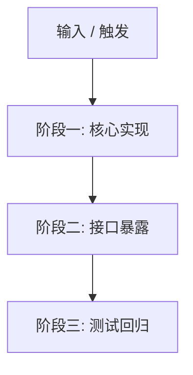

# [Plan] 功能/任务实施计划标题

- **目标 Issue**: #[Issue编号]
- **实施分支**: `feat/[feature-name]` 或 `fix/[bug-name]`
- **负责人**: [开发者 / Agent]
- **状态**: 计划中 (Planned) | 进行中 (In Progress) | 已完成 (Completed)

---

## 1. 背景与目标 (Context & Goal)

[简述本次实施计划要交付的核心功能、解决的关键问题或修复的缺陷。]

---

## 2. 核心架构与设计原则 (Architecture & Invariants)

[梳理本次改动涉及的系统边界、核心数据流以及必须遵守的架构不变式。]

---

## 3. 详细任务分解 (Task Breakdown)

### 阶段一：核心底层实现
- [ ] 模块设计与骨架搭建
- [ ] 核心业务逻辑与异常处理

### 阶段二：接口与命令暴露
- [ ] CLI / MCP 工具更新
- [ ] 交互输出与帮助文档完善

### 阶段三：测试套件与回归验证
- [ ] 编写针对性单元测试
- [ ] 覆盖异常边界与不变式断言

---

## 4. 验证与验收标准 (Verification & Acceptance)

- [ ] 全量单元测试绿灯通过 (`uv run python -m unittest discover -s tests -v`)
- [ ] 静态语法与代码风格检查通过 (`uvx ruff check ...`)
- [ ] 编译与打包通过 (`uv run python -m compileall ... && uv build`)
- [ ] PR 关联并成功创建
