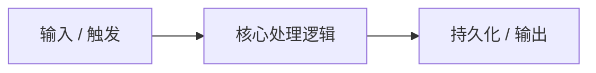

# [RFC] 提案标题 (Title)

- **作者 (Author)**: [作者名 / Agent]
- **状态 (Status)**: 草稿 (Draft) | 评审中 (Under Review) | 已采纳 (Accepted) | 已关闭 (Closed)
- **创建日期 (Created)**: YYYY-MM-DD
- **关联 Issue / PR**: #[Issue编号]

---

## 1. 背景与动机 (Background & Motivation)

[阐述为什么要发起该提案，当前的痛点是什么，用户或系统的需求是什么。]

---

## 2. 目标与非目标 (Goals and Non-Goals)

### 目标 (Goals)
- [必须达成的核心功能与指标]
- [可量化的验收标准]

### 非目标 (Non-Goals)
- [明确本次提案**不包含**的内容与边界，防止需求蔓延]

---

## 3. 详细技术方案 (Detailed Design)

[包括架构图、数据流、关键模块接口、数据结构契约、并发与容灾设计等。]

---

## 4. 备选方案与对比 (Alternatives Considered)

| 方案 | 优势 | 劣势 | 弃用原因 |
| :--- | :--- | :--- | :--- |
| **备选方案 A** | ... | ... | ... |
| **备选方案 B** | ... | ... | ... |

---

## 5. 风险与缓解措施 (Risks & Mitigations)

- **性能风险**: [分析及对策]
- **数据安全与回滚**: [分析及对策]
- **兼容性影响**: [分析及对策]

---

## 6. 未决问题 (Open Questions)

- [ ] [列出目前尚未确定的技术细节或待用户/团队裁决的选项]
