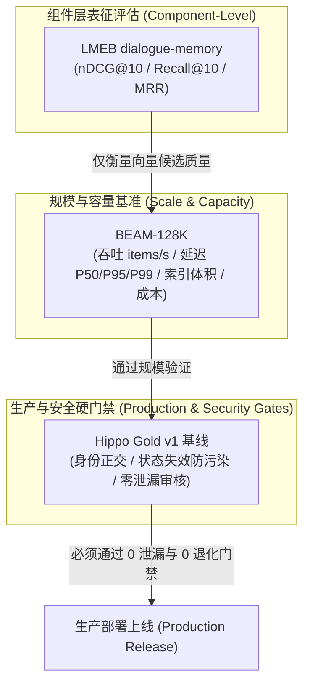

# 规模评测与 Embedding 选型对比运维手册 (BEAM-128K & LMEB)

本手册指导在 Hippo 记忆系统演进过程中，如何通过 **BEAM-128K** 规模基准与 **LMEB** 对话记忆组件对比套件，进行生产级容量规划、吞吐压测与向量模型选型评估。

---

## 1. 核心定位与安全边界

Hippo 评测体系采用分层度量模型：



> [!CAUTION] 核心安全红线 (Component vs Production Gate)
> **LMEB/BEAM 均为学术与组件级基准，其高分仅反映向量表征或基础召回能力，绝不等于生产端到端质量。**
> 任何 Embedding 模型选型、维度裁剪（MRL）或索引调优，在采用前**必须在 `hippo_gold_v1` 上完整通过四大安全硬门禁（跨用户、跨项目、过期事实与 forbidden zero leakage）**。

---

## 2. 离线快速验证 (Replay Smoke Test)

在无公网连接或无需启动外部依赖的 CI 环境中，推荐使用内置 Smoke Fixture：

### 2.1 BEAM 规模评测 Smoke
```bash
uv run python -m benchmarks.runner --dataset beam-fixture --adapter replay
```
**预期输出**：
- 输出写入吞吐（items/s）、延迟分位数（P50/P95/P99 ms）、Token 预估与成本测算；
- 生成 `benchmarks/reports/report_beam-128k.json` 与 `.md`。

### 2.2 LMEB 组件对比 Smoke
```bash
uv run python -m benchmarks.runner --dataset lmeb-fixture --adapter replay
```
**预期输出**：
- 输出 nDCG@10、Recall@10、MRR、Recall@3；
- 输出显式免责声明并生成 `benchmarks/reports/report_lmeb-dialogue-memory.json` 与 `.md`。

---

## 3. 生产级规模压测实操 (BEAM-128K)

### 3.1 前置检查
确保本地 Qdrant 常驻服务健康且监听 `127.0.0.1:6333`：
```bash
hippo doctor
curl -s http://127.0.0.1:6333/healthz
```

### 3.2 运行全量 BEAM-128K 评测
```bash
uv run python -m benchmarks.runner \
  --dataset beam-128k \
  --adapter engine \
  --output-dir benchmarks/reports/scale
```
> [!NOTE] 物理隔离原则
> 命令行若未显式指定 `--collection`，系统会自动创建 `eval_beam_{timestamp}_{uuid}` 临时集合，测试完成后自动销毁，绝不干扰用户生产记忆库。

### 3.3 核心性能指标参考与排障

| 指标 (Metric) | 达标基准 (Target) | 告警排查动作 |
| :--- | :---: | :--- |
| **写入吞吐 (Throughput)** | `> 50 items/s` | 检查 Qdrant 批量批次大小、本地磁盘 IOPS、Python 进程 CPU 负载 |
| **查询延迟 P50** | `< 15.0 ms` | 确认 Qdrant 内存索引常驻，无频繁磁盘换页 |
| **查询延迟 P95** | `< 50.0 ms` | 检查混合检索 BM25 词表分词耗时与并发锁竞争 |
| **查询延迟 P99** | `< 100.0 ms` | 排查操作系统 GC 停顿或 Surge 代理流量劫持本地回环导致的额外时延 |
| **索引内存占用** | `< 250 MB / 10K items` | 考虑引入标量量化 (Scalar Quantization) 或 MRL 降维 |

---

## 4. Embedding 模型选型与对比流程 (LMEB)

当考虑引入更轻量、更高维或开源自部署的向量模型（如 BAAI/bge-m3、KaLM-embedding 或 OpenAI text-embedding-3）时，请遵循以下流程：

### 4.1 候选模型 LMEB 并列度量
针对多个待评估 Profile 分别生成测试报告：
```bash
# 评估候选 Profile A
uv run python -m benchmarks.runner \
  --dataset lmeb-dialogue \
  --adapter engine \
  --profile direct-facts \
  --report-name lmeb_profile_bge

# 评估候选 Profile B
uv run python -m benchmarks.runner \
  --dataset lmeb-dialogue \
  --adapter engine \
  --profile mem0-session \
  --report-name lmeb_profile_openai
```

### 4.2 决策矩阵三要素
1. **nDCG@10 (权重 40%)**：衡量排序前位的质量。高 nDCG 能有效降低下游 LLM 注入的上下文噪音；
2. **Recall@10 (权重 30%)**：衡量召回上限覆盖度；
3. **向量维度与开销 (权重 30%)**：若 512 维与 1536 维的 nDCG 差距小于 `0.015`，优先选用 512 维以节约 60% 存储与延迟。

### 4.3 终审：Hippo Gold v1 安全门禁复验
在决定替换默认生产 Embedding 之前，**必须**运行：
```bash
uv run python -m benchmarks.runner \
  --dataset benchmarks/data/hippo_gold_v1.json \
  --adapter engine \
  --baseline benchmarks/gold/approved_baselines/engine_default.json
```
**严格判定**：
- `Security Hard Gates` 必须 `PASSED ✅`；
- Forbidden Leakage 必须为 0；
- Recall@3 回归退化题数必须为 0。

---

## 5. 常见问题与异常排查

### Q1: 运行 `--dataset beam` 报错 `the named official BEAM-128K benchmark must use --adapter engine`
- **原因**：官方基准测试禁止使用离线 mock/replay 充当正式结果。
- **解法**：在 CI 或单元测试中使用 `--dataset beam-fixture --adapter replay`；在实际环境中使用 `--adapter engine`。

### Q2: 误传 `--tier oracle-reader` 报错误
- **原因**：BEAM/LMEB 仅评估检索层与规模，不包含问答 Reader/Judge 层。
- **解法**：去掉 `--tier` 参数（默认 `retrieval`）。
